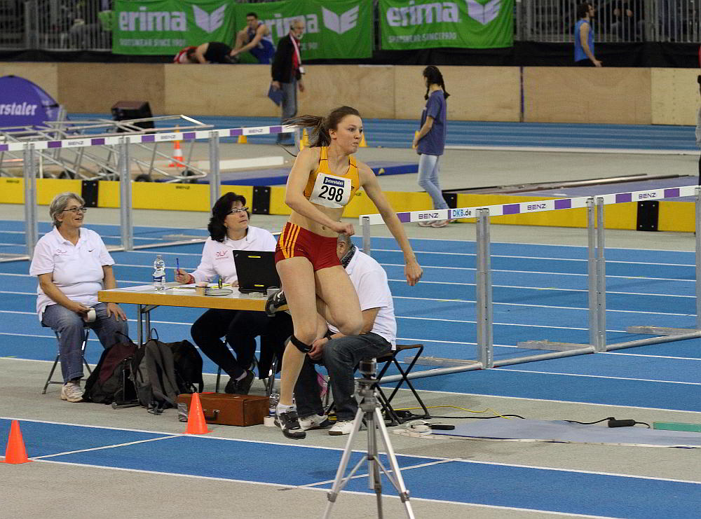

Title: Luisa Stroppel gewinnt Gold in Karlsruhe
Published: 25/01/2016
Tags: Wettkampf
Author: Bernd Siebler
---

Luisa Stroppel vom Leichtathletik Club Überlingen (LC Überlingen) gewann bei den Baden-Württembergischen Meisterschaften U18 in der Karlsruher Messehalle souverän Gold im Dreisprung.

Den ersten Versuch übertrat die junge Dreispringerin, jedoch setzte sie sich mit ihrem zweiten Sprung über 11,55m bereits an den ersten Platz des Feldes. Im dritten Sprung konnte sie bis auf 1cm an ihre bisherige Bestleistung von 11,84m heranspringen. Die Korrekturen durch Bundestrainer Tamas Kiss konnte Stroppel in den folgenden Versuchen gut umsetzen, so dass die Sprünge wesentlich schneller und weiter wurden. Durch die gewonnene zusätzliche Geschwindigkeit war sie im Anlauf zu instabil, so dass sie die weiteren Sprünge nicht halten konnte oder das Sprungbrett übertrat, so dass am Ende 11,83m als beste Weite stehen blieb - dies bedeutet den zweiten Platz in der aktuellen deutschen Hallen-Bestenliste.

Karlsruhe war ein sehr gelungener Start in die Hallensaison. Die neue baden-württembergische Meisterin wird am kommenden Wochenende in Sindelfingen bei den Süddeutschen Meisterschaften als Favoritin an den Start gehen.

Luisa Stroppel vom LC Überlingen wurde in der Karlsruher Messehalle Baden-württembergische Meisterin im Dreisprung. Souverän gewann sie Gold und sprang mit 11,83m auf den zweiten Platz der aktuellen deutschen Bestenliste.