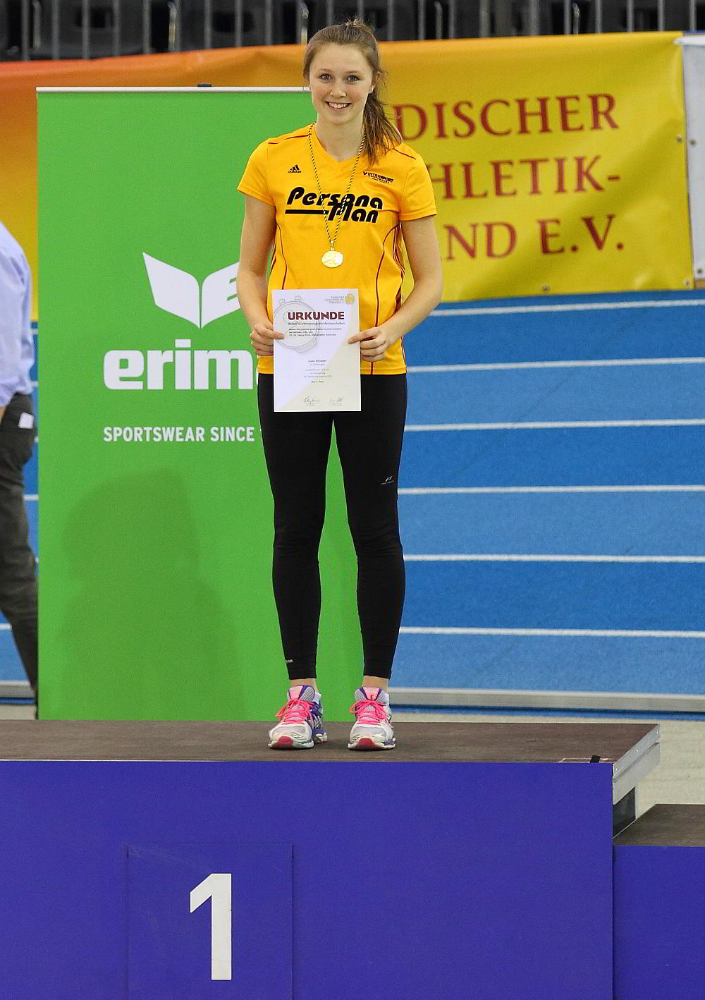

Title: Luisa Stroppel wird Süddeutsche Meisterin
Published: 25/01/2016
Tags: Wettkampf
Author: Bernd Siebler
---

Am 30.1.16 fanden im Glaspalast in Sindelfingen die süddeutschen Hallenleichtathletikmeisterschaften der Aktiven und der U 18 statt. Luisa Stroppel vom Leichtathletik Club Überlingen (LC Überlingen), die erst eine Woche zuvor die  Baden-Württembergischen Hallenmeisterschaften in Karlsruhe souverän gewonnen hatte, ging als Favoritin in den Wettkampf. Gleich im ersten Durchgang erreichte sie mit 11,60 m eine Weite, die von keiner Athletin im laufenden Wettkampf erreicht wurde. Sukzessive steigerte sich die junge Dreispringerin und sprang im vierten Versuch mit 11,79 m nur 5 cm an ihre bisherige Bestleistung heran. Dies bedeutete Tagesbestweite und reichte zum ungefährdeten Sieg als Süddeutsche Meisterin.

Die junge Vereinskollegin Iris Amann startete als 14jährige bei den U18 im Kugelstoßen. Die Kaderathletin nutzte die Meisterschaften, um Wettkampferfahrung bei starker Konkurrenz zu sammeln. Mit 11,50 m kam sie bis auf 3 cm an ihre bisherige Bestleistung heran. Dies war ein letzter Test vor ihrem Hallensaisonhöhepunkt, den Badischen Meisterschaften am übernächsten Wochenende in Mannheim, bei denen sie als Favoritin gemeldet ist.

Luisa Stroppel vom LC Überlingen wurde im Dreisprung souverän süddeutsche Meisterin. Mit 11,79 m sprang sie bis auf 5 cm an ihre Bestleistung heran.