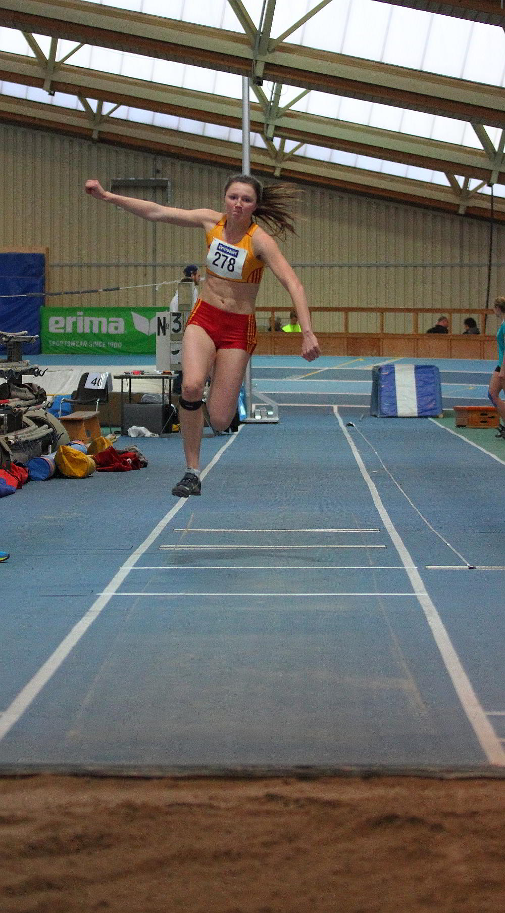

Title: Stroppel und Siebler glänzen bei den Badischen in Mannheim
Published: 13/02/2016
Tags: Wettkampf
Author: Bernd Siebler
---

Luisa Stroppel und Johanna Siebler vom Leichtathletik Club Überlingen (LC Überlingen).gewannen vier Medaillen bei den Badischen Meisterschaften U18 in Mannheim.

Luisa Stroppel wurde überlegen Badische Meisterin im Dreisprung. Ihr reichte nur ein gültiger Versuch über 11,63 m für den ersten Platz. Erstmals sprang sie vom 11 m Brett, so dass sie sich an den neuen Anlauf gewöhnen musste und öfters übertrat oder durch hohe Geschwindigkeit den Versuch abbrechen musste. Mit ihrer bisherigen Bestweite von 11,83 m liegt sie auf dem vierten Platz der aktuellen Deutschen Hallenbestenliste.

Die Mehrkämpferin Johanna Siebler gewann in drei spannenden Duellen jeweils die Silbermedaille und lag immer knapp hinter den Spezialistinnen. Im Hürdensprintfinale erwischte sie einen optimalen Start und lag bis zur dritten Hürde vor Katja Schwab von der TG Stockach, die nur schwer ins Rennen kam. Schwab holte jedoch aufgrund ihrer brillanten Hürdentechnik auf und gewann mit 8,93 s das Finale. Siebler stellte mit 9,02 s ihr PB ein.

Im direkt anschließenden Kugelstoßen kam Siebler gleich mit 13,81 m knapp an ihre PB von 13,88 m heran und lag bis zum dritten Versuch in Führung. Im vierten Versuch wurde sie überholt und wurde somit Badische Vizemeisterin.

Im Weitsprung legte Siebler eine Serie von sehr guten Sprüngen - alle deutlich über 5 m - hin. Mit ihrem besten Versuch über 5,45 m und der dritten Silbermedaille war sie am Ende sehr zufrieden. 

Luisa Stroppel vom LC Überlingen wurde mit 11,63 m überlegen Badische Meisterin im Dreisprung.