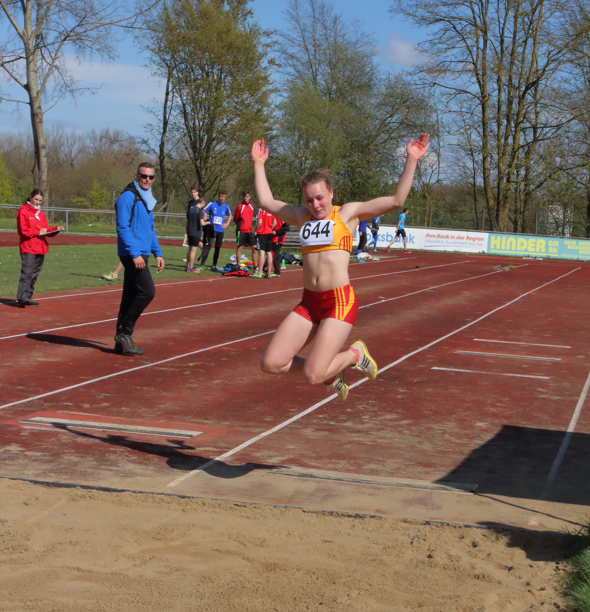

Title: Kramer stellt badischen Rekord ein
Published: 18/04/2016
Tags: Wettkampf
Author: Bernd Siebler
---

Lisa Kramer (W15) vom Leichtathletik Club Überlingen (LC Überlingen) stellt bei der Bahneröffnung in Aulendorf mit 11,50 m den Badischen Rekord im Dreisprung ein.
Furios startete Lisa Kramer in die Freiluftsaison. Bereits im Februar hatte sie bei den Badischen Hallen-Meisterschaften in Mannheim mit 16,38 m die Goldmedaille im Fünfsprung gewonnen. Deshalb war ihr Heimtrainer Bernd Siebler auch zuversichtlich, dass sie in dieser Saison in Deutschland ganz vorne mit dabei sein wird: „Dass Lisa ein großes Dreisprung-Talent ist, hatte sie in den letzten Monaten im Training und bei den Badischen Hallen-Meisterschaften bewiesen. Dass sie jedoch gleich in ihrem ersten Dreisprung-Wettkampf in solche Dimensionen springt, hätte ich noch nicht erwartet.“
Mit diesem Sprung hat sie nicht nur den Badischen Rekord aus dem Jahre 2011 von Sina Grummel aus Bühl mit 11,50 m eingestellt, sondern sie hat auch die beiden Normen von 10,70 m für den D-Kader und die Deutschen Meisterschaften in Bremen bei weitem überboten.

Die Leistung ist umso höher einzuschätzen, da in Aulendorf stark wechselnde Böen herrschten, so dass sich die Anlaufgestaltung als äußerst schwierig erwies. Bei ihrem besten Versuch wurden die seitlichen Winde mit 1,2 m Gegenwind berechnet. Auch ihr zweitbester Versuch von 11,15m kann sich sehen lassen.

Mit diesem starken ersten Auftritt sprang sich Kramer gleich in die Deutsche Spitze der sich im Aufwärtstrend befindlichen nationalen Dreisprung-Szene. Bisher hatte Kramer beim LC Überlingen eine breit angelegte Mehrkampfausbildung erfahren. Im vergangenen Jahr konnte sie sich gleich mehrfach für die Deutschen Meisterschaften im Block Sprint/ Sprung, mit der Mannschaft in der 4x100 m Staffel und im 7-Kampf qualifizieren. Ein spezifisches Dreisprungtraining hatte sie bisher noch nicht absolviert. Deshalb darf man gespannt sein, wie sie sich in den kommenden Monaten entwickeln wird. Denn nun wird sie das Training im Dreisprung systematisch angehen und intensivieren.
Luisa Stroppel (U18) startete dafür nicht so gut in die Freiluftsaison. Die siegverwöhnte Kaderathletin hatte in der Halle alle Wettkämpfe im Dreisprung gewonnen und wurde auch deutlich Süddeutsche Meisterin. Zum einen hatte Stroppel durch die starken Windböen Anlaufprobleme und zum anderen passte ihre Technik nicht, so dass sie nur einen gültigen Versuch von 10,80 m hatte.
Auch Johanna Siebler (U18) hatte bei ihrem 200m Lauf mit starkem Gegenwind zu kämpfen und kam mit 27,32 s als erste ins Ziel. Im Hochsprung sprang sie solide über 1,55 m und gewann den Wettbewerb.
Lars Neuschl (U20), der erst vor einigen Wochen mit der Leichtathletik begonnen hatte, wagte sich an 110 m Hürden und meisterste den Lauf über die 99cm hohen Hürden in 19,38 s. Im Speerwurf kam er auf 32,78 m.

Lisa Kramer vom LC Überlingen stellte den Badischen Rekord im Dreisprung mit 11,50 m ein. Bereits zum Saisonstart in Aulendorf eine starke Leistung, die auf eine Leistungssteigerung im Laufe der kommenden Monate hoffen lässt.