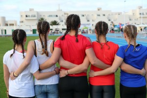
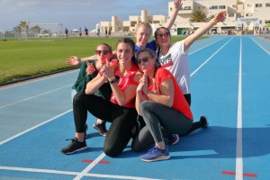
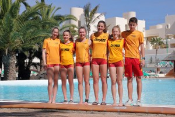
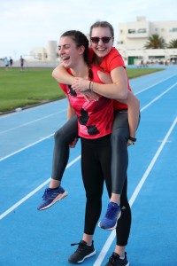

Title: Reif für die Insel
Published: 10/02/2019
Tags: Trainingslager
Author: Ute Jansen
---

Das erste Trainingslager des LCÜ fand in diesem Jahr auf der spanischen Kanareninsel Lanzarote statt. Fünf Athletinnen und ein Athlet sowie deren Trainer Bernd Siebler bestiegen am 26. Januar den Flieger Richtung Kanaren und freuten sich auf eine Woche intensives Training. Nach einem tollen Saisonauftakt, waren alle hochmotiviert. Johanna Siebler, Lisa Kramer und Ella Buchner, die allesamt U20 Athletinnen sind und sich auf der Deutschen Bestenliste unter den „Top 10“ befinden, hatten gute Gründe sich bestens auf die bevorstehende Saison vorzubereiten. Doch auch unsere drei U16 Athletinnen und Athleten haben ein erfolgsversprechendes Jahr vor sich! „Hahn im Korb“ war Tim Jansen, dem es zwischen den fünf Mädels Johanna Siebler, Lisa Kramer, Ella Buchner, Marisa Jurtz und Clara Endres immer blendend ging.

## Auf geht's!

Das hörten unsere Sportler gleich mehrmals täglich. Trainiert wurde meist morgens und nachmittags. Das waren immerhin bis zu sechs Stunden Hochleistung am Tag. Trainer Bernd Siebler konzentrierte sich dieses Mal bei den 7-Kämpferinnen und dem 9-Kämpfer hauptsächlich auf Hürden, Kugel und Speer. Immerhin bietet das Leichtathletikareal auf Lanzarote alle Möglichkeiten, die man sich nur wünschen kann. So konnte auch beim Aufwärmtraining variiert werden und alle hatten viel Spaß dabei beim Trampolin-Gym so richtig ins Schwitzen zu kommen und bis zu 400 Muskeln gleichzeitig zu trainieren. Einzig das Wetter spielte nicht dauerhaft mit. Man konnte zwar draußen trainieren, doch der starke Wind machte es den Athleten nicht immer leicht. Im besten Fall gab’s Rückenwind! Ella Buchner (Stabhochsprung) und Lisa Kramer (Dreisprung) konzentrierten sich natürlich vorwiegend auf ihre Einzeldisziplinen und hatten zwischendurch auch mit Schmerzen in der Ferse und im Handgelenk zu tun. Dann ging es eben ab in den Kraftraum, wo man auf hochmodernen Fahrrädern mit Bildschirm seine Beschwerden schnell vergessen konnte. Half das nicht, dann wurde abends auch noch massiert!

## Endlich Pause!

Obwohl jeder stark an seine Grenzen kam, verbrachten die Athleten ihre freie Zeit nicht etwa mit „chillen“. Es wurden Märkte besucht, Kart gefahren, in der Disco getanzt und natürlich alle sportlichen Angebote des Club La Santa ausgeschöpft. Beeindruckt waren alle vom Mix aus Vulkangestein und tropischer Vegetation. Bei der mediterranen Küche war für jeden etwas dabei. Sogar die spanischen Sprachkenntnisse wurden verbessert, denn „aquí se habla español“! Die Stimmung war ausgelassen und entspannt.

## İHasta la próxima! Bis zum nächsten Mal!

Als krönenden Abschluss gab es noch ein Hochsprungtraining von Thomas Zacharias, der auf Lanzarote lebt, Bundestrainer war und zu den besten Hochspringern der Welt gehörte. Zacharias war auch als Seniorensportler noch sehr aktiv und erreichte Weltrekorde. Für unsere Athleten war es eine Ehre mit ihm trainieren zu dürfen. Die Tage vergingen wie im Flug, doch die Ziele für 2019 sind definiert und am Flughafen konnten einige getrost sagen:“ İHasta la próxima!, denn im März kommen wir wieder.

Fotos von Bernd Siebler.