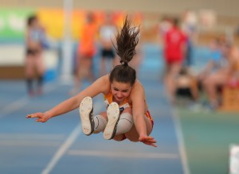
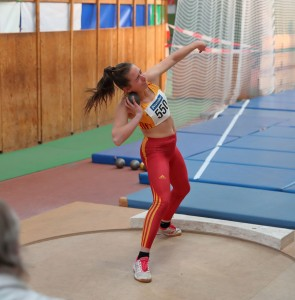
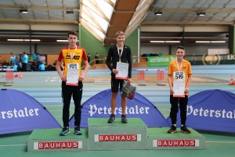

Title: Badische Hallenmeisterschaften Mannheim U14 und U16
Published: 20/02/2019
Tags: Wettkampf
Author: Ute Jansen
---

Clara Endres (W14) hatte gleich mit großem Stress zu kämpfen, da das Kugelstoßen und der 60 m Hürdenlauf parallel liefen. Im Kugelstoßen wurde sie souverän mit einer neuen persönlichen Bestleistung (PB) von 10,01 m Badische Meisterin. Dramatischer war ihr Hürdenlauf, bei dem sie im Vorlauf gegen die vorletzte Hürde stieß und damit viel wertvolle Zeit verlor. Im B-Finale konnte sie sich nochmals verbessern und stellte mit 10,14 sec eine neue PB auf und landete auf dem 5. Platz. Beim Weitsprung gelang es ihr mit 4,92m die Silbermedaille zu gewinnen, obwohl sie sich hier vom Absprung aus der Zone auf einen Absprung vom Brett umstellen musste.

Erfolgreich starten die beiden Überlinger Florian Elsenhans und Tim Jansen (beide M15) beim Stabhochsprung. Tim Jansen (2,70m) holte die Silbermedaille und Florian Elsenhans (2,50m) die Bronzemedaille. Tim Jansen gewann zudem beim Kugelstoßen die Bronzemedaille und erreichte mit 11,62 m eine neue PB, die nur knappe 8 cm hinter der Silbermedaille lag. „Das war ein bisschen mehr als mein großer Zeh“, ärgerte sich Jansen, doch alles in allem war er zufrieden.

Marisa Jurtz (W15) holte im 60 m Hürdenlauf Silber mit PB von 9,20 sec und beim Hochsprung Bronze, ebenfalls mit PB von 1,55 m. Auch im Kugelstoßen stellte sie mit 10,32m eine neue PB auf und erreichte den 6. Platz.

Pia Schmidt-Rüdt verpasste mit 8,67 sec (PB) im 60m Sprint das Finale nur um 0,01 sec. Im 5er Sprunglauf wurde sie mit 14,81m fünfte und im Weitsprung belegte sie mit 4,36m den 9. Platz

Beim 3 x 100m Staffellauf erreichten die drei Überlingerinnen den 6. Platz mit 40,28 sec.

Bilder von Bernd Siebler.