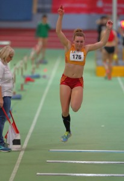

Title: Drei Athletinnen des LC Überlingen bei den Deutschen Meisterschaften
Published: 21/02/2019
Tags: Wettkampf
Author: Bernd Siebler
---

Gleich drei Athletinnen des Leichtathletik Club Überlingen (LC Überlingen) zählen bei den Deutschen Hallen-Meisterschaften U20 im Glaspalast Sindelfingen am Wochenende zum erweiterten Favoritenkreis.

Allen voran die Bundeskaderathletin Lisa Kramer, die mit 12,49m derzeit auf dem vierten Platz der offiziellen deutschen Jahres-Bestenliste im Dreisprung liegt. Die U18 EM Teilnehmerin 2018 ist mit 12,76m badische Rekordhalterin. „Wenn Lisa ihr Leistungsvermögen abrufen kann, ist sie eine Kandidatin für eine Medaille“, ist sich ihr Überlinger Heim-Trainer Bernd Siebler sicher und ergänzt: „In den vergangenen Wochen hat Lisa systematisch auf die Deutschen Meisterschaften hin trainiert und sich kontinuierlich verbessert: sie steigerte ihre Sprungkraft und wurde im Sprint wesentlich schneller.“

Eine weitere Medaillenkandidatin ist die Stabhochspringerin Ella Buchner, die sich in dieser Hallen-Saison rasant verbessert hat. Sie steigerte Mitte Januar ihre persönliche Bestleistung (PB) um 20cm auf 3,80m und konnte diese am vergangenen Wochenende bei den Badischen Meisterschaften nochmals um 5cm steigern. Damit liegt sie auf dem sechsten Platz der Meldeliste für die Deutschen Hallen-Meisterschaften. Bei den Badischen in Mannheim sprang Buchner erstmals längere und härtere Stäbe, denn in den vergangenen Wochen konnte sie ihre Kraft- und Schnelligkeitswerte stark verbessern. Buchner war in Mannheim völlig verblüfft, welche Leistungssteigerung solche Stäbe erwirken können: „Es hat mich fast umgehauen, als ich plötzlich die Kräfte spürte, mit denen mich die Stäbe in die Luft katapultiert haben.“ Neben ihrem Heimtrainer wird sie in Sindelfingen auch vom Nachwuchs-Bundestrainer Stephan Munz betreut werden. Für Buchner ist die Bundeskadernorm von 3,90m in greifbarer Nähe.

Als dritte im Bunde wird die Mehrkämpferin Johanna Siebler im Kugelstoßen den Ring betreten. Mit ihrer neuen PB von 14,33m, die sie bei den Badischen erreichte, liegt sie auf dem fünften Platz der bereinigten Meldeliste. Kugelstoßen war neben Hürden einer der beiden Trainingsschwerpunkte im Winter. Sollte es der Zeitplan zulassen, wird Siebler auch noch im 60m Hürden-Sprint starten. Auf die kurze Distanz hat es die Bundeskaderathletin allerdings schwer, sich für das Finale zu qualifizieren, da sie sich in der Startbeschleunigung verbessern muss. Über die 100m Distanz in der Freiluftsaison kann sich Siebler in der deutschen Spitze behaupten.

Ein Trainingslager Ende Januar auf Lanzarote sorgte bei allen drei Athletinnen für den vorletzten Schliff. Sie konnten dort nochmals die Schnellkraft verbessern und an ihrer Technik feilschen. Alle drei hoffen, ihr Potential abrufen zu können und an ihre PBs heranzukommen oder gar zu verbessern. Deutsche Meisterschaften bilden den richtigen Rahmen für ein solches Vorhaben.

## Kramer Dreisprung

Lisa Kramer vom LC Überlingen ist eine der Favoritinnen bei den Deutschen Hallen-Meisterschaften U20 am kommenden Wochenende im Glaspalast in Sindelfingen. Sie liegt derzeit im Dreisprung mit 12,49m auf dem vierten Platz der Deutschen Jahres-Bestenliste. Diese Leistung erzielte sie vor einem Monat an gleicher Stelle beim Sindelfinger Hallenmeeting (Foto).

Foto von Bernd Siebler.