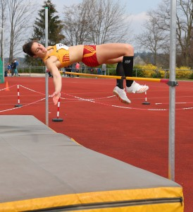
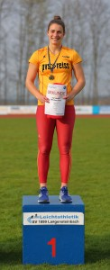

Title: Siebler knackt Badischen Rekord von 1987
Published: 01/05/2019
Tags: Wettkampf
Author: Bernd Siebler
---

Johanna Siebler (U20) vom Leichtathletik Club Überlingen (LC Überlingen) startete fulminant in die neue Saison. Beim Karlsbader Mehrkampftag in Langensteinbach übertraf sie mit 3301 Punkten den bisherigen Badischen Rekord (3286 Punkte) von Dagmar Seel von der MTG Mannheim aus dem Jahr 1987 im Vierkampf deutlich.
Gleich in der ersten Disziplin, dem Hürdensprint, erreichte sie eine neue persönliche Bestleistung (PB) von 14,16 sec. Auch im Hochsprung setzte sie ein Ausrufezeichen mit der Einstellung ihrer PB von 1,60m. Vor einigen Monaten wechselte sie das Sprungbein auf links und zeigte erstmals in einem Wettkampf ihr großes Potential in dieser Disziplin.

Auch im Kugelstoßen kam sie mit 14,41m knapp an ihre PB von 14,56m heran. Der abschließende 200m Sprint war eine Herausforderung, denn derzeit befindet sich Siebler im Trainingsaufbau und hatte vor dem Lauf schwere Beine. Mit 26,16 sec schaffte sie Ihr Ziel, die erforderliche Zeit für den Badischen Rekord zu unterbieten.

Alles in allem ein sehr gelungener Saisoneinstieg – umso höher einzuschätzen, da die Witterung alles andere als förderlich war: Wind mit niedrigen Temperaturen um die zwölf Grad. Siebler war sich im Vorfeld sicher, dass sie den Rekord brechen kann: „Ich wusste, dass ich den Rekord in dieser Saison erreichen kann. Dass dies gleich im ersten Wettkampf unter widrigen Verhältnissen passiert, macht mich zuversichtlich für die anstehenden Höhepunkte der Saison.“
Der Wettkampf bedeutet für Siebler der letzte Test vor dem ersten Norm-Wettkampf in vier Wochen in Halle (Saale) für die U20 Europameisterschaft in Schweden.

Johanna Siebler vom LC Überlingen startete mit Badischem Rekord von 3301 Punkten im Vierkampf fulminant in die neue Saison ein. Dabei konnte sie im Hürdensprint eine neue PB von 14,16 sec aufstellen und im Hochsprung ihre PB von 1,60m einstellen.

Fotos von Bernd Siebler