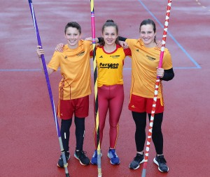

Title: LC Überlingen mit Erfolgen in Tailfingen
Published: 09/05/2019
Tags: Wettkampf
Author: Bernd Siebler
---

Der Leichtathletik Club Überlingen (LC Überlingen) war beim 14. Tailfinger Sprung- und Hürdenmeeting in Albstadt-Tailfingen überaus erfolgreich: Sechs Athleten, sechs Starts und fünf Persönliche Bestleistungen (PB) krönten den frühen Wettkampf der Saison.

Die drei Stabhochspringer Florian Elsenhans (M15: 2,62m), Clara Endres (W14: 2,32m) und Clara Zang (W14: 2,32m) konnten eine PB aufstellen. Clara Zang absolvierte dabei ihrem ersten Stabhochsprung-Wettkampf.

Im Hürdensprint über 80m konnte Marisa Jurtz (W15) ihre PB um 0,1 sec auf 12,29sec steigern. Damit führt sie derzeit die Badische Bestenliste an.

Pia Schmidt-Rüdt konnte in ihrem ersten Hürdenlauf über 80m mit 14,38sec sehr zufrieden sein. Ebenso Newcomerin Clara Wichmann (W13), die mit 12,02 sec in ihrem zweiten Hürdenlauf über 60m neue Erfahrungen sammelte.

Foto von Bernd Siebler.