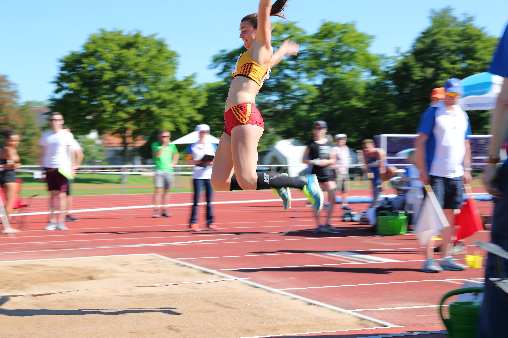
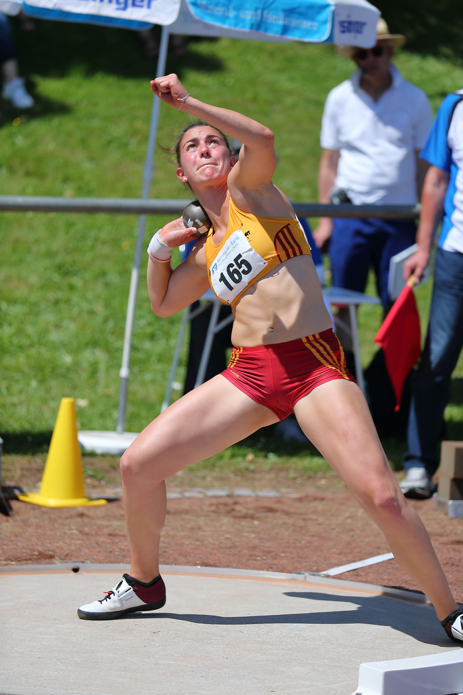
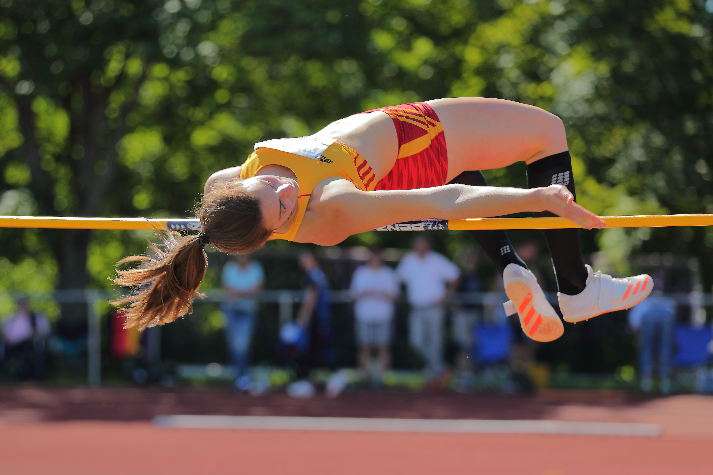
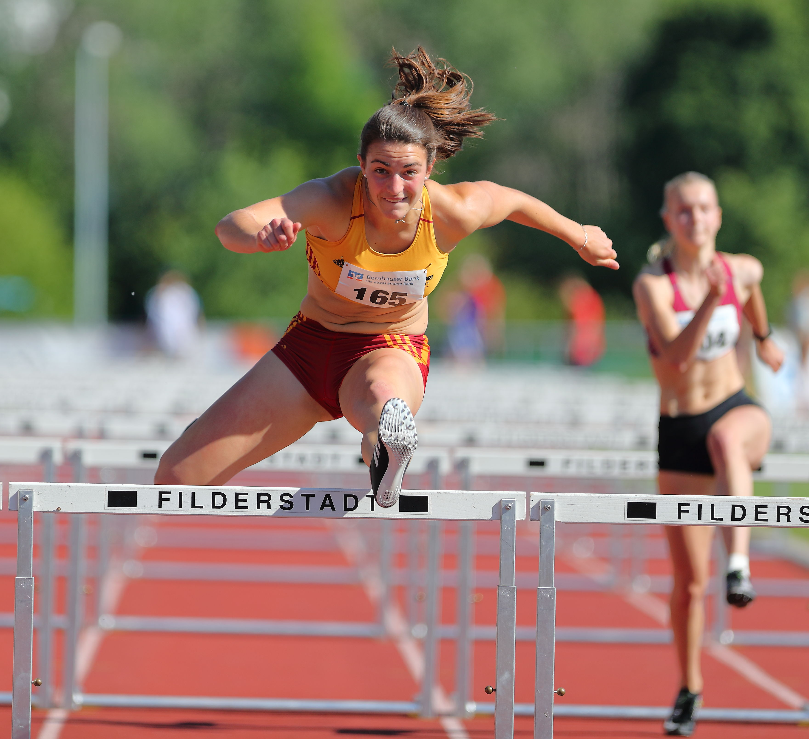
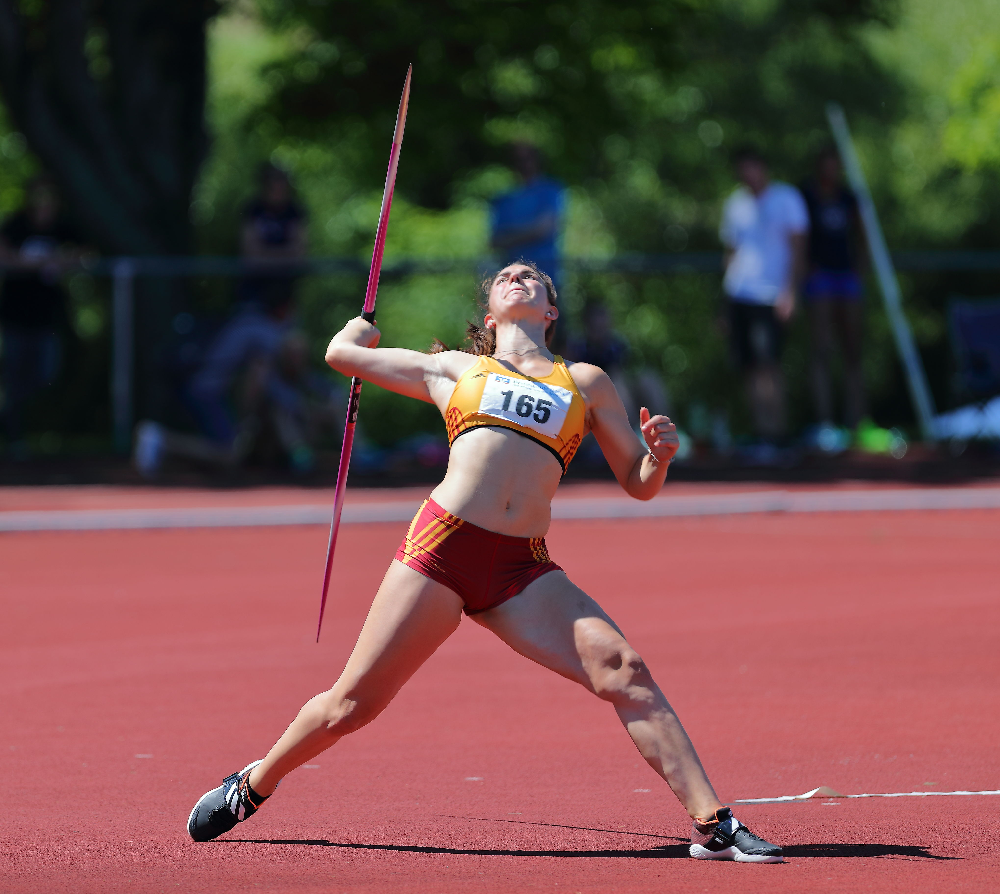
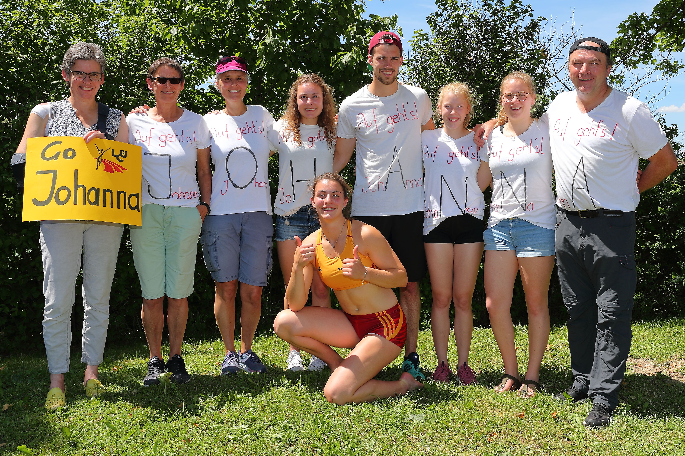

Title: Siebenkämpferin Johanna Siebler schafft Sprung zur U-20-EM
Published: 03/06/2019
Tags: Wettkampf
Author: Rainer Jäckle
---
Beim Qualifikations-Wettkampf in Bernhausen wurde die 18-jährige Überlingerin Zweite und löste damit das Ticket zur ihrer vierten internationalen Meisterschaft.

Am Ende war Johanna Siebler vom Leichtathletik Club Überlingen glücklich und erleichtert, das Ticket zur U-20-Europameisterschaft in der Tasche zu haben. Allerdings war sie mit den erreichten 5503 Punkten nicht ganz zufrieden, auch wenn sie zum zweiten Mal innerhalb von drei Wochen die Norm für den U-23-Bundeskader geknackt hat.

„Natürlich freue ich mich, dass ich nun definitiv im schwedischen Borås Mitte Juli dabei bin“, sagte Johanna Siebler nach dem Siebenkampf in Bernhausen bei Filderstadt. „Allerdings kam ich irgendwie nicht richtig in den Wettkampf und hatte mir in fast allen Disziplinen etwas mehr erhofft.“ Dabei ging es mit 14,33 Sekunden über die 100 Meter Hürden und der Einstellung der Bestleistung von 1,64 Meter im Hochsprung ganz gut los. Im Kugelstoßen (14,04 Meter) und über 200 Meter (26,06 Sekunden) ließ die Überlingerin aber einiges liegen, auch wenn sie nach dem ersten Tag noch in Führung war.

Bernd Siebler, ihr Vater und Trainer ist mit dem Erfolg seiner Tochter vollauf zufrieden: „Johanna zeigte wieder einmal, wie professionell sie inzwischen mit den unterschiedlichsten Situationen im Siebenkampf umgehen kann. Warum keine Topleistungen möglich waren, werden wir in den kommenden Tagen in Ruhe analysieren, wahrscheinlich war es ein Mix aus verschiedenen Elementen.“ Das plötzlich heiße Wetter trug sicherlich auch dazu bei.

Am zweiten Tag steigerte sich Johanna Siebler im Weitsprung im dritten Versuch zwar noch auf 5,62 Meter, aber die schärfste Konkurrentin, Lucie Kienast aus Halle, legte mit 6,06 Meter enorm vor und zog in der Gesamtwertung vorbei. Im Speerwurf holte sich die Überlingerin mit 45,17 Meter zwar die Führung wieder zurück, doch im abschließenden 800-Meter-Lauf war Lucie Kienast deutlich besser, so dass die 2:29,64 Minuten von Johanna Siebler nur zu Platz zwei reichten. Allerdings durften sich in Bernhausen die ersten drei als Sieger fühlten, denn es wurden genauso viele Tickets zur U-20-EM vergeben.

„Der Wettkampf war ganz o.k., aber ich hätte schon sehr gerne die 5700 Punkte geknackt“, sagte die hoffnungsvolle Siebenkämpferin vom Bodensee. Das wäre dann die Norm für die den Perspektivkader gewesen. Und Johanna Siebler nimmt es sportlich und fügt mit einem Schmunzeln hinzu: „Dann kann ich ja 5700 Punkte in Borås knacken.“

Dieses Ziel wird die Überlingerin zwischen dem 18. bis 21. Juli in Schweden erneut versuchen. Dann bestreitet sie ihren bereits vierten großen internationalen Wettkampf in Folge. Dies ist bisher noch keiner Siebenkämpferin in Deutschland in der Jugend gelungen. U-18-Vizeweltmeisterin war sie bereits. Ob es in Borås erneut zu einer Medaille reicht, ist momentan schwer zu sagen. Bis dahin wird sie jedenfalls noch akribisch trainieren. Und für die U-20-EM hat sie bislang nur ein Ziel: 5700 Punkte. „Wenn ich das schaffe, werden wir sehen, auf welchem Platz ich lande“, sagt Johanna Siebler, die gemeinsam mit Lucie Kienast und Joanna Schiffer aus Neubrandenburg die deutschen Farben in Schweden vertreten wird. Und eines steht jetzt schon fest: Wenn Johanna Siebler die 5700 Punkte schafft, wird sie ganz vorne mitmischen können.

Bilder von Jakob Siebler